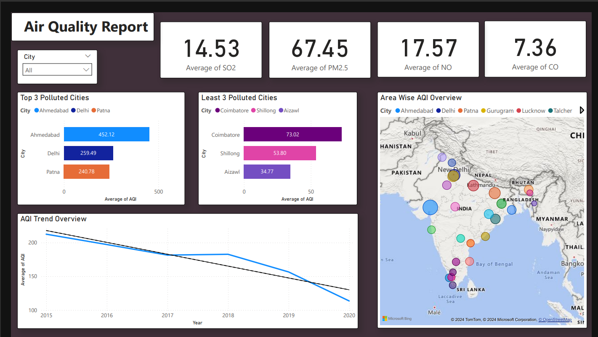
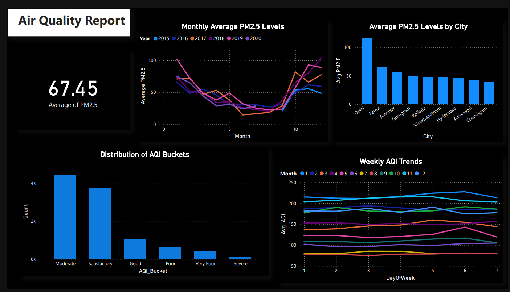

# Air-Quality-Index-Data-Engineering-Project
## Air Quality Index Pipeline using Spark, AWS-S3, Databricks and PowerBI

## Introduction
This Air Quality Index (AQI) Data Engineering project aims to analyze and visualize air quality data in India. Leveraging AWS S3 for storage, Azure Databricks and Apache Spark for data processing with PySpark, and Power BI for interactive visualizations, this project provides insights into air pollution patterns and trends across various regions in India. The end goal is to enable data-driven decision-making for environmental health and policy planning.

## Architecture 
.png)

## Technology Used 
1.Programming Language - Python

2.Spark - Apache Spark and Pyspark

3.AWS-S3 Cloud Storage

4.Databricks

5.PowerBI 

 ## Dataset Used 
 Dataset Used - (https://www.kaggle.com/datasets/rohanrao/air-quality-data-in-india)

## Some Useful Datasets After Transformation 
AQI-Distribution-(https://github.com/Akash-8442/Air-Quality-Index-Data-Engineering-Project/blob/main/aqi_distribution.csv)

Avrage-AQI-City-Daily-Data - (https://github.com/Akash-8442/Air-Quality-Index-Data-Engineering-Project/blob/main/avg_aqi_city_day.csv)

city-pm25 - (https://github.com/Akash-8442/Air-Quality-Index-Data-Engineering-Project/blob/main/city_pm25.csv)

monthly_pm25 - (https://github.com/Akash-8442/Air-Quality-Index-Data-Engineering-Project/blob/main/monthly_pm25.csv)

## Scripts for Project 
[AQI Data Analysis IPYNB File](https://github.com/Akash-8442/Air-Quality-Index-Data-Engineering-Project/blob/main/INDIA%20AIR%20QUALITY%20ANALYSIS.ipynb)

[Power BI pbix FILE](https://github.com/Akash-8442/Air-Quality-Index-Data-Engineering-Project/blob/main/AQI_INDIA_Dashboard.pbix)

## Some Project Outcomes 

